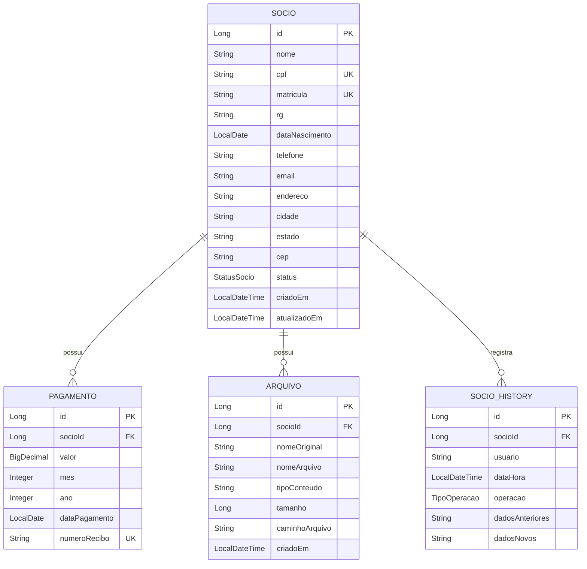

# Design Document: Gestão Completa de Sócios

## Overview

Este documento especifica o design técnico para três funcionalidades integradas do sistema de gerenciamento do sindicato rural: visualização detalhada de sócios, edição de dados de sócios e gestão de arquivos vinculados. Estas funcionalidades complementam o CRUD básico existente, fornecendo uma experiência completa de gerenciamento de informações dos associados.

### Objetivos

- Fornecer visualização completa e somente leitura dos dados do sócio, incluindo histórico de pagamentos e arquivos
- Permitir edição segura e validada de todos os dados cadastrais do sócio
- Gerenciar upload, visualização, download e exclusão de arquivos vinculados a cada sócio
- Manter histórico completo de alterações para auditoria
- Garantir integração fluida entre as três funcionalidades

### Escopo

**Incluído:**
- Componente de visualização detalhada (frontend)
- Componente de edição de sócio (frontend)
- Componente de gestão de arquivos (frontend)
- Endpoints REST para operações de leitura, atualização e gestão de arquivos
- Validações de dados no frontend e backend
- Registro de histórico de alterações
- Tratamento de erros e feedback ao usuário

**Excluído:**
- Criação de novos sócios (já implementado)
- Exclusão de sócios (já implementado)
- Gestão de pagamentos (já implementado)
- Geração de relatórios
- Notificações por email


## Architecture

### Visão Geral da Arquitetura

O sistema segue uma arquitetura em camadas com separação clara de responsabilidades:

```
┌─────────────────────────────────────────────────────────────┐
│                     Frontend (Angular)                       │
├─────────────────────────────────────────────────────────────┤
│  ┌──────────────┐  ┌──────────────┐  ┌──────────────┐      │
│  │   Socio      │  │    Socio     │  │   Arquivo    │      │
│  │   Detail     │  │    Form      │  │   Manager    │      │
│  │  Component   │  │  Component   │  │  Component   │      │
│  └──────────────┘  └──────────────┘  └──────────────┘      │
│         │                 │                  │              │
│         └─────────────────┴──────────────────┘              │
│                           │                                 │
│                  ┌────────▼────────┐                        │
│                  │  Socio Service  │                        │
│                  │ Arquivo Service │                        │
│                  └────────┬────────┘                        │
└───────────────────────────┼─────────────────────────────────┘
                            │ HTTP/REST
┌───────────────────────────┼─────────────────────────────────┐
│                  ┌────────▼────────┐                        │
│                  │   Controllers   │                        │
│                  │  (REST Layer)   │                        │
│                  └────────┬────────┘                        │
│                           │                                 │
│                  ┌────────▼────────┐                        │
│                  │    Services     │                        │
│                  │ (Business Logic)│                        │
│                  └────────┬────────┘                        │
│                           │                                 │
│                  ┌────────▼────────┐                        │
│                  │  Repositories   │                        │
│                  │  (Data Access)  │                        │
│                  └────────┬────────┘                        │
│                           │                                 │
│                  ┌────────▼────────┐                        │
│                  │    Database     │                        │
│                  │   (PostgreSQL)  │                        │
│                  └─────────────────┘                        │
│                     Backend (Spring Boot)                   │
└─────────────────────────────────────────────────────────────┘
```

### Padrões Arquiteturais

1. **MVC (Model-View-Controller)**: Separação entre apresentação, lógica de negócio e dados
2. **Repository Pattern**: Abstração da camada de acesso a dados
3. **Service Layer**: Encapsulamento da lógica de negócio
4. **DTO Pattern**: Transferência de dados entre camadas com objetos específicos
5. **Dependency Injection**: Gerenciamento de dependências via Spring e Angular

### Fluxo de Dados

**Visualização de Sócio:**
```
User → SocioDetailComponent → SocioService → GET /api/socios/{id} 
→ SocioController → SocioService → SocioRepository → Database
→ SocioResponse → Component → Template
```

**Edição de Sócio:**
```
User → SocioFormComponent → Validation → SocioService → PUT /api/socios/{id}
→ SocioController → Validation → SocioService → SocioRepository → Database
→ SocioHistoryService → AuditService → Response → Component
```

**Gestão de Arquivos:**
```
User → ArquivoManagerComponent → ArquivoService → POST /api/arquivos
→ ArquivoController → Validation → ArquivoService → FileSystem + Database
→ ArquivoRepository → Response → Component
```


## Components and Interfaces

### Frontend Components

#### 1. SocioDetailComponent

**Responsabilidade:** Exibir todos os dados do sócio em modo somente leitura, incluindo histórico de pagamentos e arquivos vinculados.

**Interface:**
```typescript
interface SocioDetailComponent {
  socioId: number;
  socio: SocioResponse | null;
  pagamentos: PagamentoResponse[];
  arquivos: ArquivoResponse[];
  historico: HistoricoAlteracao[];
  loading: boolean;
  error: string | null;
  
  ngOnInit(): void;
  loadSocio(id: number): void;
  navigateToEdit(): void;
  close(): void;
}
```

**Dependências:**
- SocioService
- Router
- ActivatedRoute

#### 2. SocioFormComponent (Extensão)

**Responsabilidade:** Permitir edição de todos os campos do sócio com validação completa.

**Interface:**
```typescript
interface SocioFormComponent {
  socioId: number | null;
  socioForm: FormGroup;
  loading: boolean;
  error: string | null;
  
  ngOnInit(): void;
  initForm(): void;
  loadSocio(id: number): void;
  onSubmit(): void;
  onCancel(): void;
  validateCPF(control: AbstractControl): ValidationErrors | null;
  validateTelefone(control: AbstractControl): ValidationErrors | null;
  validateCEP(control: AbstractControl): ValidationErrors | null;
}
```

**Validações:**
- CPF: Formato XXX.XXX.XXX-XX (11 dígitos)
- Telefone: Formato brasileiro (10-11 dígitos)
- CEP: 8 dígitos numéricos
- Email: RFC 5322
- Campos obrigatórios: nome, CPF, matrícula

#### 3. ArquivoManagerComponent

**Responsabilidade:** Gerenciar upload, visualização, download e exclusão de arquivos vinculados ao sócio.

**Interface:**
```typescript
interface ArquivoManagerComponent {
  socioId: number;
  arquivos: ArquivoResponse[];
  selectedFile: File | null;
  uploading: boolean;
  error: string | null;
  
  ngOnInit(): void;
  loadArquivos(): void;
  onFileSelected(event: Event): void;
  validateFile(file: File): boolean;
  uploadFile(): void;
  downloadFile(arquivo: ArquivoResponse): void;
  viewFile(arquivo: ArquivoResponse): void;
  deleteFile(arquivo: ArquivoResponse): void;
  confirmDelete(arquivo: ArquivoResponse): void;
  formatFileSize(bytes: number): string;
}
```

**Validações:**
- Tipos permitidos: PDF, DOC, DOCX, JPG, JPEG, PNG
- Tamanho máximo: 10MB
- Nome do arquivo não vazio

### Backend Controllers

#### 1. SocioController (Extensão)

**Novos Endpoints:**

```java
@GetMapping("/{id}/detalhes")
public ResponseEntity<SocioDetalhadoResponse> getSocioDetalhado(@PathVariable Long id)

@PutMapping("/{id}")
public ResponseEntity<SocioResponse> updateSocio(
    @PathVariable Long id,
    @Valid @RequestBody SocioUpdateRequest request,
    @AuthenticationPrincipal UserDetails userDetails)

@GetMapping("/{id}/historico")
public ResponseEntity<List<HistoricoAlteracaoResponse>> getHistoricoAlteracoes(@PathVariable Long id)
```

#### 2. ArquivoController (Já Implementado)

**Endpoints Existentes:**

```java
@PostMapping
public ResponseEntity<ArquivoResponse> uploadArquivo(
    @RequestParam("socioId") Long socioId,
    @RequestParam("file") MultipartFile file)

@GetMapping("/{id}")
public ResponseEntity<Resource> downloadArquivo(@PathVariable Long id)

@DeleteMapping("/{id}")
public ResponseEntity<Void> deleteArquivo(@PathVariable Long id)

@GetMapping("/socio/{socioId}")
public ResponseEntity<List<ArquivoResponse>> getArquivosBySocio(@PathVariable Long socioId)
```

### Backend Services

#### 1. SocioService (Extensão)

**Novos Métodos:**

```java
public SocioDetalhadoResponse getSocioDetalhado(Long id)
public SocioResponse updateSocio(Long id, SocioUpdateRequest request, String username)
private void validateSocioUpdate(SocioUpdateRequest request)
private Socio findSocioOrThrow(Long id)
```

#### 2. SocioHistoryService (Já Implementado)

**Métodos Existentes:**

```java
public void recordCreation(Socio socio, String usuario)
public void recordUpdate(Socio oldSocio, Socio newSocio, String usuario)
public void recordDeletion(Socio socio, String usuario)
public List<SocioHistory> getHistoryBySocioId(Long socioId)
```

#### 3. ArquivoService (Já Implementado)

**Métodos Existentes:**

```java
public ArquivoResponse uploadArquivo(Long socioId, MultipartFile file)
public Resource downloadArquivo(Long id)
public void deleteArquivo(Long id)
public List<ArquivoResponse> getArquivosBySocio(Long socioId)
private void validarArquivo(MultipartFile file)
```


## Data Models

### DTOs (Data Transfer Objects)

#### SocioDetalhadoResponse

```java
public class SocioDetalhadoResponse {
    private Long id;
    private String nome;
    private String cpf;
    private String matricula;
    private String rg;
    private LocalDate dataNascimento;
    private String estadoCivil;
    
    // Endereço
    private String cep;
    private String endereco;
    private String numero;
    private String complemento;
    private String bairro;
    private String cidade;
    private String estado;
    
    // Contato
    private String telefone;
    private String celular;
    private String email;
    
    // Status e metadados
    private StatusSocio status;
    private LocalDateTime criadoEm;
    private LocalDateTime atualizadoEm;
    
    // Relacionamentos
    private List<PagamentoResponse> pagamentos;
    private List<ArquivoResponse> arquivos;
}
```

#### SocioUpdateRequest

```java
public class SocioUpdateRequest {
    @NotBlank(message = "Nome é obrigatório")
    @Size(max = 100)
    private String nome;
    
    @NotBlank(message = "CPF é obrigatório")
    @Pattern(regexp = "\\d{3}\\.\\d{3}\\.\\d{3}-\\d{2}")
    private String cpf;
    
    @NotBlank(message = "Matrícula é obrigatória")
    @Size(max = 20)
    private String matricula;
    
    @Size(max = 20)
    private String rg;
    
    private LocalDate dataNascimento;
    
    @Size(max = 20)
    private String estadoCivil;
    
    // Endereço
    @Pattern(regexp = "\\d{5}-\\d{3}")
    private String cep;
    
    @Size(max = 255)
    private String endereco;
    
    @Size(max = 10)
    private String numero;
    
    @Size(max = 100)
    private String complemento;
    
    @Size(max = 100)
    private String bairro;
    
    @Size(max = 100)
    private String cidade;
    
    @Size(max = 2)
    private String estado;
    
    // Contato
    @Pattern(regexp = "\\(\\d{2}\\) \\d{4,5}-\\d{4}")
    private String telefone;
    
    @Pattern(regexp = "\\(\\d{2}\\) \\d{4,5}-\\d{4}")
    private String celular;
    
    @Email
    @Size(max = 100)
    private String email;
    
    @NotNull
    private StatusSocio status;
}
```

#### HistoricoAlteracaoResponse

```java
public class HistoricoAlteracaoResponse {
    private Long id;
    private Long socioId;
    private String usuario;
    private LocalDateTime dataHora;
    private String operacao; // CREATE, UPDATE, DELETE
    private Map<String, CampoAlterado> camposAlterados;
}

public class CampoAlterado {
    private String nomeCampo;
    private String valorAnterior;
    private String valorNovo;
}
```

#### ArquivoResponse (Já Implementado)

```java
public class ArquivoResponse {
    private Long id;
    private Long socioId;
    private String nomeOriginal;
    private String nomeArquivo;
    private String tipoConteudo;
    private Long tamanho;
    private String tamanhoFormatado;
    private LocalDateTime criadoEm;
}
```

### Entidades do Banco de Dados

#### Socio (Já Implementado)

```java
@Entity
@Table(name = "socios")
public class Socio {
    @Id
    @GeneratedValue(strategy = GenerationType.IDENTITY)
    private Long id;
    
    @Column(nullable = false, length = 100)
    private String nome;
    
    @Column(unique = true, nullable = false, length = 14)
    private String cpf;
    
    @Column(unique = true, nullable = false, length = 20)
    private String matricula;
    
    @Column(length = 20)
    private String rg;
    
    @Column(name = "data_nascimento")
    private LocalDate dataNascimento;
    
    @Column(length = 20)
    private String telefone;
    
    @Column(length = 100)
    private String email;
    
    @Column(columnDefinition = "TEXT")
    private String endereco;
    
    @Column(length = 50)
    private String cidade;
    
    @Column(length = 2)
    private String estado;
    
    @Column(length = 10)
    private String cep;
    
    @Enumerated(EnumType.STRING)
    @Column(nullable = false, length = 20)
    private StatusSocio status;
    
    @CreationTimestamp
    @Column(name = "criado_em", nullable = false, updatable = false)
    private LocalDateTime criadoEm;
    
    @UpdateTimestamp
    @Column(name = "atualizado_em", nullable = false)
    private LocalDateTime atualizadoEm;
    
    @OneToMany(mappedBy = "socio", cascade = CascadeType.ALL)
    private List<Pagamento> pagamentos;
    
    @OneToMany(mappedBy = "socio", cascade = CascadeType.ALL)
    private List<Arquivo> arquivos;
}
```

#### SocioHistory (Já Implementado)

```java
@Entity
@Table(name = "socio_history")
public class SocioHistory {
    @Id
    @GeneratedValue(strategy = GenerationType.IDENTITY)
    private Long id;
    
    @Column(name = "socio_id", nullable = false)
    private Long socioId;
    
    @Column(nullable = false, length = 100)
    private String usuario;
    
    @Column(name = "data_hora", nullable = false)
    private LocalDateTime dataHora;
    
    @Enumerated(EnumType.STRING)
    @Column(nullable = false, length = 20)
    private TipoOperacao operacao;
    
    @Column(name = "dados_anteriores", columnDefinition = "TEXT")
    private String dadosAnteriores;
    
    @Column(name = "dados_novos", columnDefinition = "TEXT")
    private String dadosNovos;
}
```

#### Arquivo (Já Implementado)

```java
@Entity
@Table(name = "arquivos")
public class Arquivo {
    @Id
    @GeneratedValue(strategy = GenerationType.IDENTITY)
    private Long id;
    
    @ManyToOne(fetch = FetchType.LAZY)
    @JoinColumn(name = "socio_id", nullable = false)
    private Socio socio;
    
    @Column(name = "nome_original", nullable = false)
    private String nomeOriginal;
    
    @Column(name = "nome_arquivo", nullable = false)
    private String nomeArquivo;
    
    @Column(name = "tipo_conteudo", nullable = false, length = 100)
    private String tipoConteudo;
    
    @Column(nullable = false)
    private Long tamanho;
    
    @Column(name = "caminho_arquivo", nullable = false, length = 500)
    private String caminhoArquivo;
    
    @Column(name = "criado_em", nullable = false, updatable = false)
    private LocalDateTime criadoEm;
}
```

### Relacionamentos




## Correctness Properties

*A property is a characteristic or behavior that should hold true across all valid executions of a system-essentially, a formal statement about what the system should do. Properties serve as the bridge between human-readable specifications and machine-verifiable correctness guarantees.*

### Property Reflection

Após análise dos critérios de aceitação, identifiquei as seguintes propriedades testáveis. Durante a reflexão, eliminei redundâncias:

**Propriedades Consolidadas:**
- Propriedades 1.2, 1.3, 1.4, 1.5 foram consolidadas em uma única propriedade sobre renderização completa de dados
- Propriedades 2.3, 2.4, 2.5, 2.6 foram mantidas separadas pois testam validadores diferentes
- Propriedades 5.1, 5.2, 5.3, 5.4 foram consolidadas em uma propriedade sobre registro completo de histórico
- Propriedades 3.2 e 3.3 foram mantidas separadas pois testam aspectos diferentes da validação

### Property 1: Visualização Completa de Dados do Sócio

*For any* sócio válido no sistema, quando renderizado no visualizador de detalhes, todos os campos obrigatórios (dados pessoais, endereço, contato e status) devem estar presentes na saída renderizada.

**Validates: Requirements 1.2, 1.3, 1.4, 1.5**

### Property 2: Ordenação de Pagamentos por Data

*For any* sócio com múltiplos pagamentos, a lista de pagamentos exibida no visualizador deve estar ordenada por data em ordem cronológica decrescente (mais recente primeiro).

**Validates: Requirements 1.6**

### Property 3: Exibição de Metadados de Arquivos

*For any* arquivo vinculado a um sócio, a renderização do arquivo deve conter nome original, tipo de conteúdo, tamanho formatado e data de upload.

**Validates: Requirements 1.7, 3.9**

### Property 4: Validação de CPF

*For any* string de entrada, o validador de CPF deve aceitar apenas strings no formato XXX.XXX.XXX-XX onde X são dígitos numéricos, e rejeitar todas as outras.

**Validates: Requirements 2.3**

### Property 5: Validação de Telefone

*For any* string de entrada, o validador de telefone deve aceitar apenas strings no formato brasileiro (XX) XXXXX-XXXX ou (XX) XXXX-XXXX, e rejeitar todas as outras.

**Validates: Requirements 2.4**

### Property 6: Validação de CEP

*For any* string de entrada, o validador de CEP deve aceitar apenas strings com exatamente 8 dígitos numéricos (formato XXXXX-XXX), e rejeitar todas as outras.

**Validates: Requirements 2.5**

### Property 7: Validação de Email

*For any* string de entrada, o validador de email deve aceitar apenas strings que atendam ao padrão RFC 5322, e rejeitar todas as outras.

**Validates: Requirements 2.6**

### Property 8: Validação de Campos Obrigatórios

*For any* requisição de atualização de sócio, se algum campo obrigatório (nome, CPF, matrícula) estiver vazio ou nulo, o validador deve rejeitar a requisição com mensagem de erro específica.

**Validates: Requirements 2.7**

### Property 9: Persistência de Atualização (Round-trip)

*For any* conjunto de dados válidos de sócio, após salvar a atualização no banco de dados e recarregar o sócio, os dados retornados devem ser equivalentes aos dados salvos.

**Validates: Requirements 2.9**

### Property 10: Registro Completo de Histórico

*For any* atualização de dados de sócio, deve ser criado um registro no histórico contendo: data/hora da modificação, usuário que realizou a modificação, campos alterados, e valores anteriores e novos de cada campo modificado.

**Validates: Requirements 2.10, 5.1, 5.2, 5.3, 5.4**

### Property 11: Validação de Tipo de Arquivo

*For any* arquivo selecionado para upload, o validador deve aceitar apenas arquivos com extensões PDF, DOC, DOCX, JPG, JPEG ou PNG (case-insensitive), e rejeitar todos os outros tipos.

**Validates: Requirements 3.1, 3.2**

### Property 12: Validação de Tamanho de Arquivo

*For any* arquivo selecionado para upload, o validador deve aceitar apenas arquivos com tamanho menor ou igual a 10MB (10.485.760 bytes), e rejeitar arquivos maiores.

**Validates: Requirements 3.3**

### Property 13: Persistência de Upload de Arquivo (Round-trip)

*For any* arquivo válido enviado para upload vinculado a um sócio, após o upload bem-sucedido, deve existir um registro no banco de dados contendo todos os metadados (nome original, tipo, tamanho, data de upload, ID do sócio), e o arquivo físico deve estar acessível no sistema de arquivos.

**Validates: Requirements 3.6, 3.7**

### Property 14: Preservação de Nome Original no Download

*For any* arquivo armazenado no sistema, quando o usuário solicita o download, o nome do arquivo baixado deve ser idêntico ao nome original do arquivo no momento do upload.

**Validates: Requirements 3.12**

### Property 15: Remoção Completa de Arquivo

*For any* arquivo excluído do sistema, após a confirmação da exclusão, não deve existir registro do arquivo no banco de dados nem o arquivo físico no sistema de arquivos.

**Validates: Requirements 3.15**

### Property 16: Ordenação de Arquivos por Data

*For any* sócio com múltiplos arquivos vinculados, a lista de arquivos exibida deve estar ordenada por data de upload em ordem cronológica decrescente (mais recente primeiro).

**Validates: Requirements 3.18**

### Property 17: Consistência de Dados Após Atualização

*For any* atualização de dados de sócio realizada no editor, ao retornar ao visualizador de detalhes, os dados exibidos devem refletir exatamente as alterações salvas.

**Validates: Requirements 4.4**

### Property 18: Consistência de Lista de Arquivos

*For any* operação de adição ou remoção de arquivo, a lista de arquivos exibida no visualizador de detalhes deve refletir imediatamente a mudança (arquivo adicionado deve aparecer, arquivo removido deve desaparecer).

**Validates: Requirements 4.5**

### Property 19: Manutenção de Contexto do Sócio

*For any* navegação entre visualizador de detalhes, editor e gestor de arquivos, o ID do sócio atual deve ser mantido consistente em todos os componentes, garantindo que todas as operações sejam realizadas no sócio correto.

**Validates: Requirements 4.6**

### Property 20: Ordenação de Histórico de Alterações

*For any* sócio com múltiplas alterações registradas, a lista de histórico exibida deve estar ordenada por data/hora em ordem cronológica decrescente (mais recente primeiro).

**Validates: Requirements 5.6**


## Error Handling

### Estratégia Geral

O sistema implementa tratamento de erros em múltiplas camadas:

1. **Frontend (Angular)**: Validação de entrada e feedback imediato ao usuário
2. **Backend (Spring Boot)**: Validação de negócio e tratamento de exceções
3. **Banco de Dados**: Constraints e validações de integridade

### Categorias de Erros

#### 1. Erros de Validação

**Frontend:**
- Validação em tempo real nos campos do formulário
- Mensagens de erro específicas próximas aos campos inválidos
- Destaque visual dos campos com erro (borda vermelha)
- Desabilitação do botão de submit enquanto houver erros

**Backend:**
```java
@ExceptionHandler(MethodArgumentNotValidException.class)
public ResponseEntity<ErrorResponse> handleValidationException(MethodArgumentNotValidException ex) {
    Map<String, String> errors = new HashMap<>();
    ex.getBindingResult().getFieldErrors().forEach(error -> 
        errors.put(error.getField(), error.getDefaultMessage())
    );
    return ResponseEntity.badRequest().body(new ErrorResponse("Erro de validação", errors));
}
```

**Códigos HTTP:**
- 400 Bad Request: Dados inválidos ou malformados

#### 2. Erros de Recurso Não Encontrado

**Cenários:**
- Sócio não encontrado ao tentar visualizar
- Sócio não encontrado ao tentar editar
- Arquivo não encontrado ao tentar baixar/excluir

**Tratamento:**
```java
@ExceptionHandler(ResourceNotFoundException.class)
public ResponseEntity<ErrorResponse> handleResourceNotFound(ResourceNotFoundException ex) {
    return ResponseEntity.status(HttpStatus.NOT_FOUND)
        .body(new ErrorResponse(ex.getMessage()));
}
```

**Frontend:**
- Exibir mensagem de erro clara
- Redirecionar automaticamente para a lista após 3 segundos
- Opção de retornar manualmente

**Códigos HTTP:**
- 404 Not Found: Recurso solicitado não existe

#### 3. Erros de Arquivo

**Cenários:**
- Tipo de arquivo não permitido
- Arquivo excede tamanho máximo (10MB)
- Erro ao salvar arquivo no sistema de arquivos
- Erro ao ler arquivo para download

**Tratamento:**
```java
@ExceptionHandler(InvalidFileException.class)
public ResponseEntity<ErrorResponse> handleInvalidFile(InvalidFileException ex) {
    return ResponseEntity.badRequest()
        .body(new ErrorResponse(ex.getMessage()));
}

@ExceptionHandler(FileStorageException.class)
public ResponseEntity<ErrorResponse> handleFileStorageError(FileStorageException ex) {
    return ResponseEntity.status(HttpStatus.INTERNAL_SERVER_ERROR)
        .body(new ErrorResponse("Erro ao processar arquivo: " + ex.getMessage()));
}
```

**Mensagens Específicas:**
- "Tipo de arquivo não permitido. Formatos aceitos: PDF, DOC, DOCX, JPG, JPEG, PNG"
- "Arquivo excede o tamanho máximo permitido de 10MB"
- "Erro ao salvar arquivo. Tente novamente"

**Códigos HTTP:**
- 400 Bad Request: Arquivo inválido (tipo ou tamanho)
- 500 Internal Server Error: Erro ao processar arquivo

#### 4. Erros de Comunicação

**Cenários:**
- Timeout de requisição
- Erro de rede
- Servidor indisponível

**Tratamento Frontend:**
```typescript
catchError((error: HttpErrorResponse) => {
  if (error.status === 0) {
    this.error = 'Erro ao comunicar com o servidor. Verifique sua conexão';
  } else if (error.status >= 500) {
    this.error = 'Erro no servidor. Tente novamente mais tarde';
  } else {
    this.error = error.error?.message || 'Erro desconhecido';
  }
  return throwError(() => error);
})
```

**Códigos HTTP:**
- 0: Erro de rede/conexão
- 500-599: Erros do servidor

#### 5. Erros de Conflito

**Cenários:**
- CPF duplicado ao atualizar sócio
- Matrícula duplicada ao atualizar sócio

**Tratamento:**
```java
@ExceptionHandler(DataIntegrityViolationException.class)
public ResponseEntity<ErrorResponse> handleDataIntegrityViolation(DataIntegrityViolationException ex) {
    String message = "Erro de integridade de dados";
    if (ex.getMessage().contains("cpf")) {
        message = "CPF já cadastrado no sistema";
    } else if (ex.getMessage().contains("matricula")) {
        message = "Matrícula já cadastrada no sistema";
    }
    return ResponseEntity.status(HttpStatus.CONFLICT)
        .body(new ErrorResponse(message));
}
```

**Códigos HTTP:**
- 409 Conflict: Violação de constraint de unicidade

### Feedback ao Usuário

#### Indicadores de Carregamento

- Spinner durante operações assíncronas
- Desabilitação de botões durante processamento
- Mensagem de "Carregando..." em listas vazias durante fetch

#### Mensagens de Sucesso

- Toast notification verde para operações bem-sucedidas
- Duração: 3 segundos
- Exemplos:
  - "Dados atualizados com sucesso"
  - "Arquivo enviado com sucesso"
  - "Arquivo excluído com sucesso"

#### Mensagens de Erro

- Toast notification vermelha para erros
- Duração: 5 segundos (ou até usuário fechar)
- Opção de "Tentar novamente" quando aplicável

#### Confirmações

- Dialog modal para ações destrutivas:
  - Exclusão de arquivo: "Deseja realmente excluir este arquivo?"
  - Cancelar edição com alterações não salvas: "Descartar alterações?"

### Logging

**Backend:**
```java
@Slf4j
public class SocioService {
    public SocioResponse updateSocio(Long id, SocioUpdateRequest request, String username) {
        log.info("Atualizando sócio id={} por usuário={}", id, username);
        try {
            // lógica de atualização
            log.info("Sócio id={} atualizado com sucesso", id);
        } catch (Exception e) {
            log.error("Erro ao atualizar sócio id={}: {}", id, e.getMessage(), e);
            throw e;
        }
    }
}
```

**Níveis de Log:**
- INFO: Operações bem-sucedidas
- WARN: Validações falhadas, recursos não encontrados
- ERROR: Exceções inesperadas, erros de sistema


## Testing Strategy

### Abordagem Dual de Testes

O sistema utiliza uma estratégia de testes complementar que combina:

1. **Testes Unitários**: Verificam exemplos específicos, casos extremos e condições de erro
2. **Testes Baseados em Propriedades (Property-Based Testing)**: Verificam propriedades universais através de múltiplas entradas geradas aleatoriamente

Ambos os tipos de teste são necessários para cobertura abrangente. Testes unitários capturam bugs concretos e casos específicos, enquanto testes de propriedade verificam correção geral através de randomização.

### Biblioteca de Property-Based Testing

**Backend (Java):**
- Biblioteca: **jqwik** (https://jqwik.net/)
- Integração com JUnit 5
- Configuração: Mínimo 100 iterações por teste de propriedade

**Frontend (TypeScript/Angular):**
- Biblioteca: **fast-check** (https://github.com/dubzzz/fast-check)
- Integração com Jasmine/Karma
- Configuração: Mínimo 100 iterações por teste de propriedade

### Testes de Propriedade

Cada propriedade definida na seção "Correctness Properties" deve ser implementada como um teste de propriedade. Cada teste deve incluir um comentário referenciando a propriedade do documento de design:

**Formato do Tag:**
```
Feature: gestao-completa-socios, Property {número}: {texto da propriedade}
```

#### Exemplo Backend (Java + jqwik):

```java
@Property
// Feature: gestao-completa-socios, Property 9: Persistência de Atualização (Round-trip)
void updateSocioRoundTrip(@ForAll("validSocioUpdateRequest") SocioUpdateRequest request) {
    // Arrange
    Socio socio = createTestSocio();
    socioRepository.save(socio);
    
    // Act
    SocioResponse updated = socioService.updateSocio(socio.getId(), request, "test-user");
    Socio reloaded = socioRepository.findById(socio.getId()).orElseThrow();
    
    // Assert
    assertThat(reloaded.getNome()).isEqualTo(request.getNome());
    assertThat(reloaded.getCpf()).isEqualTo(request.getCpf());
    assertThat(reloaded.getEmail()).isEqualTo(request.getEmail());
    // ... verificar todos os campos
}

@Provide
Arbitrary<SocioUpdateRequest> validSocioUpdateRequest() {
    return Combinators.combine(
        Arbitraries.strings().alpha().ofMinLength(3).ofMaxLength(100),
        cpfArbitrary(),
        Arbitraries.strings().numeric().ofLength(20)
    ).as((nome, cpf, matricula) -> {
        SocioUpdateRequest req = new SocioUpdateRequest();
        req.setNome(nome);
        req.setCpf(cpf);
        req.setMatricula(matricula);
        return req;
    });
}
```

#### Exemplo Frontend (TypeScript + fast-check):

```typescript
// Feature: gestao-completa-socios, Property 4: Validação de CPF
it('should validate CPF format correctly', () => {
  fc.assert(
    fc.property(
      fc.string(),
      (input: string) => {
        const isValid = validateCPF(input);
        const matchesFormat = /^\d{3}\.\d{3}\.\d{3}-\d{2}$/.test(input);
        
        // Se o formato está correto, deve ser válido
        // Se o formato está incorreto, deve ser inválido
        expect(isValid).toBe(matchesFormat);
      }
    ),
    { numRuns: 100 }
  );
});
```

### Testes Unitários

Os testes unitários devem focar em:

1. **Exemplos Específicos**: Casos concretos que demonstram comportamento correto
2. **Casos Extremos (Edge Cases)**: Listas vazias, valores nulos, limites
3. **Condições de Erro**: Validações falhadas, recursos não encontrados
4. **Integração entre Componentes**: Interação entre serviços e repositórios

#### Backend - Testes Unitários

**SocioServiceTest:**
```java
@Test
void getSocioDetalhado_WhenSocioExists_ReturnsCompleteData() {
    // Arrange
    Socio socio = createTestSocioWithRelations();
    when(socioRepository.findById(1L)).thenReturn(Optional.of(socio));
    
    // Act
    SocioDetalhadoResponse response = socioService.getSocioDetalhado(1L);
    
    // Assert
    assertThat(response.getId()).isEqualTo(1L);
    assertThat(response.getNome()).isEqualTo(socio.getNome());
    assertThat(response.getPagamentos()).hasSize(socio.getPagamentos().size());
    assertThat(response.getArquivos()).hasSize(socio.getArquivos().size());
}

@Test
void getSocioDetalhado_WhenSocioNotFound_ThrowsException() {
    // Arrange
    when(socioRepository.findById(999L)).thenReturn(Optional.empty());
    
    // Act & Assert
    assertThatThrownBy(() -> socioService.getSocioDetalhado(999L))
        .isInstanceOf(ResourceNotFoundException.class)
        .hasMessage("Sócio não encontrado");
}

@Test
void updateSocio_WithEmptyNome_ThrowsValidationException() {
    // Arrange
    SocioUpdateRequest request = new SocioUpdateRequest();
    request.setNome("");
    
    // Act & Assert
    assertThatThrownBy(() -> socioService.updateSocio(1L, request, "user"))
        .isInstanceOf(ValidationException.class);
}
```

**ArquivoServiceTest:**
```java
@Test
void uploadArquivo_WithValidFile_SavesSuccessfully() {
    // Arrange
    MockMultipartFile file = new MockMultipartFile(
        "file", "test.pdf", "application/pdf", "content".getBytes()
    );
    Socio socio = createTestSocio();
    when(socioRepository.findById(1L)).thenReturn(Optional.of(socio));
    
    // Act
    ArquivoResponse response = arquivoService.uploadArquivo(1L, file);
    
    // Assert
    assertThat(response.getNomeOriginal()).isEqualTo("test.pdf");
    assertThat(response.getTipoConteudo()).isEqualTo("application/pdf");
    verify(arquivoRepository).save(any(Arquivo.class));
}

@Test
void uploadArquivo_WithFileTooLarge_ThrowsException() {
    // Arrange
    byte[] largeContent = new byte[11 * 1024 * 1024]; // 11MB
    MockMultipartFile file = new MockMultipartFile(
        "file", "large.pdf", "application/pdf", largeContent
    );
    
    // Act & Assert
    assertThatThrownBy(() -> arquivoService.uploadArquivo(1L, file))
        .isInstanceOf(InvalidFileException.class)
        .hasMessageContaining("tamanho máximo");
}

@Test
void uploadArquivo_WithInvalidType_ThrowsException() {
    // Arrange
    MockMultipartFile file = new MockMultipartFile(
        "file", "test.exe", "application/x-msdownload", "content".getBytes()
    );
    
    // Act & Assert
    assertThatThrownBy(() -> arquivoService.uploadArquivo(1L, file))
        .isInstanceOf(InvalidFileException.class)
        .hasMessageContaining("Tipo de arquivo não permitido");
}
```

#### Frontend - Testes Unitários

**SocioDetailComponent:**
```typescript
describe('SocioDetailComponent', () => {
  it('should load socio details on init', () => {
    const mockSocio: SocioDetalhadoResponse = createMockSocio();
    socioService.getSocioDetalhado.and.returnValue(of(mockSocio));
    
    component.ngOnInit();
    
    expect(component.socio).toEqual(mockSocio);
    expect(component.loading).toBeFalse();
  });
  
  it('should display error message when socio not found', () => {
    socioService.getSocioDetalhado.and.returnValue(
      throwError(() => ({ status: 404, error: { message: 'Sócio não encontrado' } }))
    );
    
    component.ngOnInit();
    
    expect(component.error).toBe('Sócio não encontrado');
    expect(component.socio).toBeNull();
  });
  
  it('should display empty message when no pagamentos', () => {
    const mockSocio = createMockSocio();
    mockSocio.pagamentos = [];
    socioService.getSocioDetalhado.and.returnValue(of(mockSocio));
    
    component.ngOnInit();
    fixture.detectChanges();
    
    const emptyMessage = fixture.nativeElement.querySelector('.empty-message');
    expect(emptyMessage.textContent).toContain('Nenhum pagamento registrado');
  });
});
```

**ArquivoManagerComponent:**
```typescript
describe('ArquivoManagerComponent', () => {
  it('should validate file type', () => {
    const validFile = new File(['content'], 'test.pdf', { type: 'application/pdf' });
    expect(component.validateFile(validFile)).toBeTrue();
    
    const invalidFile = new File(['content'], 'test.exe', { type: 'application/x-msdownload' });
    expect(component.validateFile(invalidFile)).toBeFalse();
  });
  
  it('should validate file size', () => {
    const smallFile = new File(['x'.repeat(1024)], 'small.pdf', { type: 'application/pdf' });
    expect(component.validateFile(smallFile)).toBeTrue();
    
    const largeFile = new File(['x'.repeat(11 * 1024 * 1024)], 'large.pdf', { type: 'application/pdf' });
    expect(component.validateFile(largeFile)).toBeFalse();
  });
  
  it('should show confirmation dialog before delete', () => {
    spyOn(window, 'confirm').and.returnValue(true);
    const arquivo = createMockArquivo();
    
    component.deleteFile(arquivo);
    
    expect(window.confirm).toHaveBeenCalledWith('Deseja realmente excluir este arquivo?');
  });
});
```

### Testes de Integração

**Backend:**
```java
@SpringBootTest
@AutoConfigureMockMvc
class SocioIntegrationTest {
    
    @Test
    void fullUpdateWorkflow_ShouldPersistAndCreateHistory() {
        // Arrange: Criar sócio
        Socio socio = createAndSaveSocio();
        SocioUpdateRequest request = createUpdateRequest();
        
        // Act: Atualizar sócio
        mockMvc.perform(put("/api/socios/" + socio.getId())
            .contentType(MediaType.APPLICATION_JSON)
            .content(objectMapper.writeValueAsString(request))
            .header("Authorization", "Bearer " + getTestToken()))
            .andExpect(status().isOk());
        
        // Assert: Verificar persistência
        Socio updated = socioRepository.findById(socio.getId()).orElseThrow();
        assertThat(updated.getNome()).isEqualTo(request.getNome());
        
        // Assert: Verificar histórico
        List<SocioHistory> history = socioHistoryRepository.findBySocioId(socio.getId());
        assertThat(history).hasSize(1);
        assertThat(history.get(0).getOperacao()).isEqualTo(TipoOperacao.UPDATE);
    }
}
```

### Cobertura de Testes

**Metas de Cobertura:**
- Serviços: 90%+ de cobertura de linhas
- Controladores: 85%+ de cobertura de linhas
- Componentes Angular: 80%+ de cobertura de linhas
- Validadores: 100% de cobertura (crítico para segurança)

**Ferramentas:**
- Backend: JaCoCo
- Frontend: Karma + Istanbul

### Execução de Testes

**Backend:**
```bash
# Todos os testes
./mvnw test

# Apenas testes unitários
./mvnw test -Dtest="*Test"

# Apenas testes de propriedade
./mvnw test -Dtest="*PropertyTest"

# Com relatório de cobertura
./mvnw test jacoco:report
```

**Frontend:**
```bash
# Todos os testes
ng test --watch=false

# Com cobertura
ng test --code-coverage --watch=false

# Apenas um componente
ng test --include='**/socio-detail.component.spec.ts'
```


## Considerações Adicionais

### Segurança

#### Autenticação e Autorização

- Todos os endpoints requerem autenticação via JWT
- Apenas usuários autenticados podem visualizar e editar sócios
- Registro de auditoria inclui identificação do usuário que realizou a operação

#### Validação de Entrada

- Validação no frontend (UX) e backend (segurança)
- Sanitização de strings para prevenir XSS
- Validação de tipos MIME reais de arquivos (não apenas extensão)
- Limite de tamanho de arquivo aplicado no backend

#### Proteção de Dados

- CPF armazenado de forma segura
- Logs não devem conter dados sensíveis completos
- Arquivos armazenados fora do diretório web público

### Performance

#### Otimizações de Consulta

```java
// Eager loading de relacionamentos quando necessário
@Query("SELECT s FROM Socio s " +
       "LEFT JOIN FETCH s.pagamentos " +
       "LEFT JOIN FETCH s.arquivos " +
       "WHERE s.id = :id")
Optional<Socio> findByIdWithRelations(@Param("id") Long id);
```

#### Cache

- Cache de sócios frequentemente acessados (já implementado)
- Invalidação de cache após atualização
- TTL configurável por ambiente

#### Paginação

- Lista de pagamentos paginada para sócios com muitos registros
- Lista de arquivos paginada se necessário
- Histórico de alterações paginado

### Acessibilidade

#### Frontend

- Labels descritivos em todos os campos de formulário
- Atributos ARIA para leitores de tela
- Navegação por teclado funcional
- Contraste adequado de cores
- Mensagens de erro anunciadas para leitores de tela

```html
<input 
  type="text" 
  id="nome" 
  formControlName="nome"
  aria-label="Nome completo do sócio"
  aria-required="true"
  aria-invalid="{{socioForm.get('nome')?.invalid}}"
  aria-describedby="nome-error">
<span id="nome-error" role="alert" *ngIf="socioForm.get('nome')?.invalid">
  Nome é obrigatório
</span>
```

### Internacionalização (i18n)

Preparação para suporte futuro:

- Mensagens de erro externalizadas
- Formatação de datas e números configurável
- Labels e textos de UI externalizados

```typescript
// messages.pt-BR.ts
export const MESSAGES = {
  SOCIO_NOT_FOUND: 'Sócio não encontrado',
  UPDATE_SUCCESS: 'Dados atualizados com sucesso',
  FILE_TOO_LARGE: 'Arquivo excede o tamanho máximo permitido de 10MB',
  // ...
};
```

### Monitoramento e Observabilidade

#### Métricas

- Tempo de resposta dos endpoints
- Taxa de erro por operação
- Número de uploads de arquivo por dia
- Tamanho médio de arquivos

#### Logs Estruturados

```java
log.info("Sócio atualizado", 
    kv("socioId", id),
    kv("usuario", username),
    kv("camposAlterados", changedFields.size()),
    kv("duracao", duration));
```

#### Health Checks

- Verificação de conectividade com banco de dados
- Verificação de espaço em disco para arquivos
- Status dos serviços dependentes

### Escalabilidade

#### Armazenamento de Arquivos

Para ambientes de produção com múltiplas instâncias:

- Considerar migração para S3/MinIO/Azure Blob Storage
- Manter metadados no banco de dados
- URLs assinadas para download seguro

#### Processamento Assíncrono

- Upload de arquivos grandes pode ser assíncrono
- Geração de thumbnails para imagens (futuro)
- Notificações de conclusão via WebSocket

### Manutenibilidade

#### Documentação de Código

- Javadoc em todos os métodos públicos
- TSDoc em componentes e serviços Angular
- README com instruções de setup e execução

#### Versionamento de API

- Endpoints versionados: `/api/v1/socios`
- Manutenção de compatibilidade retroativa
- Deprecation notices para mudanças futuras

#### Testes Automatizados

- Pipeline CI/CD executa todos os testes
- Cobertura de código monitorada
- Testes de regressão para bugs corrigidos

### Migração e Deploy

#### Migrations de Banco de Dados

```sql
-- V5__add_socio_history_fields.sql
ALTER TABLE socio_history 
ADD COLUMN campos_alterados JSONB;

CREATE INDEX idx_socio_history_socio_id 
ON socio_history(socio_id);

CREATE INDEX idx_socio_history_data_hora 
ON socio_history(data_hora DESC);
```

#### Estratégia de Deploy

1. Deploy do backend (zero-downtime)
2. Execução de migrations
3. Deploy do frontend
4. Smoke tests automatizados
5. Monitoramento de erros

#### Rollback

- Manter versão anterior do backend disponível
- Migrations reversíveis quando possível
- Backup de banco de dados antes de deploy

### Limitações Conhecidas

1. **Tamanho de Arquivo**: Limite de 10MB pode ser restritivo para alguns documentos
2. **Tipos de Arquivo**: Lista limitada de formatos aceitos
3. **Edição Concorrente**: Não há lock otimista implementado (última escrita vence)
4. **Histórico**: Não há limite de retenção (pode crescer indefinidamente)

### Melhorias Futuras

1. **Versionamento de Documentos**: Manter versões anteriores de arquivos
2. **Preview de Arquivos**: Visualização inline de PDFs e imagens
3. **Busca em Arquivos**: Indexação e busca de conteúdo de documentos
4. **Assinatura Digital**: Suporte para assinatura eletrônica de documentos
5. **Notificações**: Alertas quando dados de sócio são alterados
6. **Auditoria Avançada**: Dashboard de auditoria com filtros e relatórios
7. **Comparação de Versões**: Diff visual entre versões do histórico
8. **Exportação de Dados**: Export de dados do sócio em PDF/Excel

