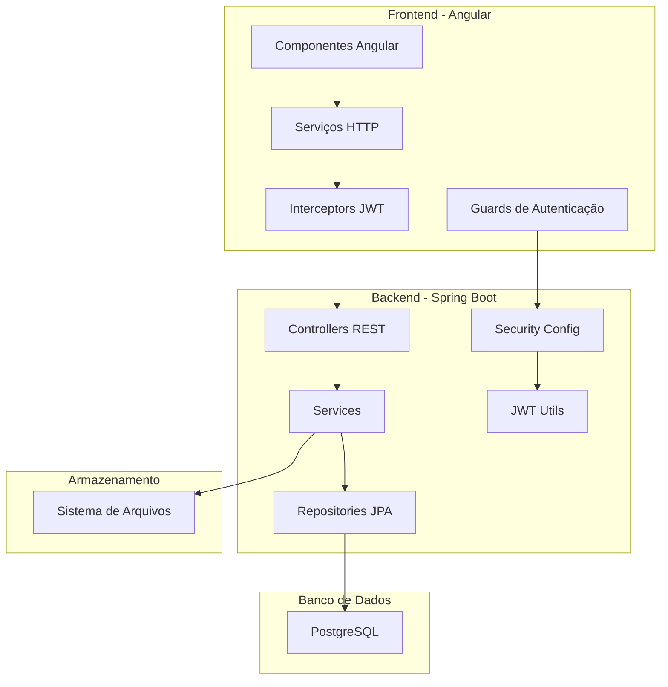

# Documento de Design

## Visão Geral

O Sistema de Gerenciamento do Sindicato Rural é uma aplicação web full-stack que utiliza Angular para o frontend, Spring Boot para o backend e PostgreSQL como banco de dados. O sistema implementa uma arquitetura RESTful com autenticação JWT, permitindo o gerenciamento completo de sócios, pagamentos mensais, geração de recibos e armazenamento de documentos.

A arquitetura segue o padrão MVC (Model-View-Controller) com separação clara entre as camadas de apresentação (Angular), lógica de negócio (Spring Boot) e persistência (PostgreSQL). A comunicação entre frontend e backend ocorre através de APIs REST seguras com autenticação baseada em tokens JWT.

## Arquitetura

### Arquitetura Geral do Sistema



### Padrões Arquiteturais

- **Frontend**: Arquitetura baseada em componentes com Angular, utilizando serviços para comunicação HTTP e guards para proteção de rotas
- **Backend**: Arquitetura em camadas (Controller → Service → Repository) seguindo princípios SOLID
- **Segurança**: Autenticação stateless com JWT, criptografia de senhas com BCrypt
- **Persistência**: JPA/Hibernate para mapeamento objeto-relacional com PostgreSQL

## Componentes e Interfaces

### Frontend - Angular

#### Componentes Principais

**LoginComponent**
- Responsável pela autenticação de administradores
- Formulário reativo com validação
- Integração com AuthService para login

**DashboardComponent**
- Página principal após login
- Navegação para funcionalidades principais
- Exibição de estatísticas básicas

**SocioListComponent**
- Listagem de sócios com paginação
- Funcionalidades de busca e filtros
- Navegação para detalhes e edição

**SocioFormComponent**
- Formulário para cadastro/edição de sócios
- Validação de campos obrigatórios
- Upload de foto do sócio

**PagamentoListComponent**
- Listagem de pagamentos com filtros
- Visualização por período e status
- Geração de relatórios

**PagamentoFormComponent**
- Registro de novos pagamentos
- Seleção de sócio e período
- Geração automática de recibo

**ArquivoManagerComponent**
- Gerenciamento de arquivos por sócio
- Upload múltiplo de documentos
- Visualização e download de arquivos

#### Serviços

**AuthService**
```typescript
interface AuthService {
  login(credentials: LoginRequest): Observable<AuthResponse>
  logout(): void
  isAuthenticated(): boolean
  getToken(): string | null
}
```

**SocioService**
```typescript
interface SocioService {
  listarSocios(filtros: FiltroSocio): Observable<PagedResponse<Socio>>
  buscarSocio(id: number): Observable<Socio>
  criarSocio(socio: SocioRequest): Observable<Socio>
  atualizarSocio(id: number, socio: SocioRequest): Observable<Socio>
  excluirSocio(id: number): Observable<void>
}
```

**PagamentoService**
```typescript
interface PagamentoService {
  listarPagamentos(filtros: FiltroPagamento): Observable<PagedResponse<Pagamento>>
  registrarPagamento(pagamento: PagamentoRequest): Observable<Pagamento>
  cancelarPagamento(id: number): Observable<void>
  gerarRecibo(pagamentoId: number): Observable<Blob>
}
```

**ArquivoService**
```typescript
interface ArquivoService {
  uploadArquivos(socioId: number, arquivos: File[]): Observable<Arquivo[]>
  listarArquivos(socioId: number): Observable<Arquivo[]>
  downloadArquivo(arquivoId: number): Observable<Blob>
  excluirArquivo(arquivoId: number): Observable<void>
}
```

### Backend - Spring Boot

#### Controllers REST

**AuthController**
```java
@RestController
@RequestMapping("/api/auth")
public class AuthController {
    @PostMapping("/login")
    ResponseEntity<AuthResponse> login(@RequestBody LoginRequest request)
    
    @PostMapping("/refresh")
    ResponseEntity<AuthResponse> refresh(@RequestHeader("Authorization") String token)
}
```

**SocioController**
```java
@RestController
@RequestMapping("/api/socios")
public class SocioController {
    @GetMapping
    ResponseEntity<Page<SocioResponse>> listarSocios(@RequestParam Map<String, String> filtros, Pageable pageable)
    
    @GetMapping("/{id}")
    ResponseEntity<SocioResponse> buscarSocio(@PathVariable Long id)
    
    @PostMapping
    ResponseEntity<SocioResponse> criarSocio(@Valid @RequestBody SocioRequest request)
    
    @PutMapping("/{id}")
    ResponseEntity<SocioResponse> atualizarSocio(@PathVariable Long id, @Valid @RequestBody SocioRequest request)
    
    @DeleteMapping("/{id}")
    ResponseEntity<Void> excluirSocio(@PathVariable Long id)
}
```

**PagamentoController**
```java
@RestController
@RequestMapping("/api/pagamentos")
public class PagamentoController {
    @GetMapping
    ResponseEntity<Page<PagamentoResponse>> listarPagamentos(@RequestParam Map<String, String> filtros, Pageable pageable)
    
    @PostMapping
    ResponseEntity<PagamentoResponse> registrarPagamento(@Valid @RequestBody PagamentoRequest request)
    
    @DeleteMapping("/{id}")
    ResponseEntity<Void> cancelarPagamento(@PathVariable Long id)
    
    @GetMapping("/{id}/recibo")
    ResponseEntity<byte[]> gerarRecibo(@PathVariable Long id)
}
```

**ArquivoController**
```java
@RestController
@RequestMapping("/api/arquivos")
public class ArquivoController {
    @PostMapping("/upload/{socioId}")
    ResponseEntity<List<ArquivoResponse>> uploadArquivos(@PathVariable Long socioId, @RequestParam("files") MultipartFile[] files)
    
    @GetMapping("/socio/{socioId}")
    ResponseEntity<List<ArquivoResponse>> listarArquivos(@PathVariable Long socioId)
    
    @GetMapping("/{id}/download")
    ResponseEntity<Resource> downloadArquivo(@PathVariable Long id)
    
    @DeleteMapping("/{id}")
    ResponseEntity<Void> excluirArquivo(@PathVariable Long id)
}
```

#### Serviços de Negócio

**AuthService**
```java
@Service
public class AuthService {
    public AuthResponse authenticate(LoginRequest request)
    public String generateToken(Usuario usuario)
    public boolean validateToken(String token)
    public String extractUsername(String token)
}
```

**SocioService**
```java
@Service
public class SocioService {
    public Page<Socio> listarSocios(FiltroSocio filtros, Pageable pageable)
    public Socio buscarSocio(Long id)
    public Socio criarSocio(SocioRequest request)
    public Socio atualizarSocio(Long id, SocioRequest request)
    public void excluirSocio(Long id)
    public boolean cpfJaExiste(String cpf, Long idExcluir)
}
```

**PagamentoService**
```java
@Service
public class PagamentoService {
    public Page<Pagamento> listarPagamentos(FiltroPagamento filtros, Pageable pageable)
    public Pagamento registrarPagamento(PagamentoRequest request)
    public void cancelarPagamento(Long id)
    public byte[] gerarReciboPdf(Long pagamentoId)
    public boolean pagamentoJaExiste(Long socioId, int mes, int ano)
}
```

**ArquivoService**
```java
@Service
public class ArquivoService {
    public List<Arquivo> uploadArquivos(Long socioId, MultipartFile[] files)
    public List<Arquivo> listarArquivos(Long socioId)
    public Resource downloadArquivo(Long id)
    public void excluirArquivo(Long id)
    public boolean validarTipoArquivo(String contentType)
    public boolean validarTamanhoArquivo(long tamanho)
}
```

## Modelos de Dados

### Entidades JPA

**Usuario**
```java
@Entity
@Table(name = "usuarios")
public class Usuario {
    @Id
    @GeneratedValue(strategy = GenerationType.IDENTITY)
    private Long id;
    
    @Column(unique = true, nullable = false)
    private String username;
    
    @Column(nullable = false)
    private String password;
    
    @Column(nullable = false)
    private String nome;
    
    @Enumerated(EnumType.STRING)
    private StatusUsuario status;
    
    @CreationTimestamp
    private LocalDateTime criadoEm;
    
    @UpdateTimestamp
    private LocalDateTime atualizadoEm;
}
```

**Socio**
```java
@Entity
@Table(name = "socios")
public class Socio {
    @Id
    @GeneratedValue(strategy = GenerationType.IDENTITY)
    private Long id;
    
    @Column(nullable = false)
    private String nome;
    
    @Column(unique = true, nullable = false)
    private String cpf;
    
    @Column(unique = true, nullable = false)
    private String matricula;
    
    private String rg;
    private LocalDate dataNascimento;
    private String telefone;
    private String email;
    private String endereco;
    private String cidade;
    private String estado;
    private String cep;
    private String profissao;
    
    @Enumerated(EnumType.STRING)
    private StatusSocio status;
    
    @CreationTimestamp
    private LocalDateTime criadoEm;
    
    @UpdateTimestamp
    private LocalDateTime atualizadoEm;
    
    @OneToMany(mappedBy = "socio", cascade = CascadeType.ALL)
    private List<Pagamento> pagamentos;
    
    @OneToMany(mappedBy = "socio", cascade = CascadeType.ALL)
    private List<Arquivo> arquivos;
}
```

**Pagamento**
```java
@Entity
@Table(name = "pagamentos")
public class Pagamento {
    @Id
    @GeneratedValue(strategy = GenerationType.IDENTITY)
    private Long id;
    
    @ManyToOne(fetch = FetchType.LAZY)
    @JoinColumn(name = "socio_id", nullable = false)
    private Socio socio;
    
    @Column(nullable = false)
    private BigDecimal valor;
    
    @Column(nullable = false)
    private int mes;
    
    @Column(nullable = false)
    private int ano;
    
    @Column(nullable = false)
    private LocalDate dataPagamento;
    
    @Column(unique = true, nullable = false)
    private String numeroRecibo;
    
    private String observacoes;
    
    @Enumerated(EnumType.STRING)
    private StatusPagamento status;
    
    @CreationTimestamp
    private LocalDateTime criadoEm;
    
    @UpdateTimestamp
    private LocalDateTime atualizadoEm;
}
```

**Arquivo**
```java
@Entity
@Table(name = "arquivos")
public class Arquivo {
    @Id
    @GeneratedValue(strategy = GenerationType.IDENTITY)
    private Long id;
    
    @ManyToOne(fetch = FetchType.LAZY)
    @JoinColumn(name = "socio_id", nullable = false)
    private Socio socio;
    
    @Column(nullable = false)
    private String nomeOriginal;
    
    @Column(nullable = false)
    private String nomeArquivo;
    
    @Column(nullable = false)
    private String tipoConteudo;
    
    @Column(nullable = false)
    private Long tamanho;
    
    @Column(nullable = false)
    private String caminhoArquivo;
    
    @CreationTimestamp
    private LocalDateTime criadoEm;
}
```

### Schema do Banco de Dados

```sql
-- Tabela de usuários administrativos
CREATE TABLE usuarios (
    id BIGSERIAL PRIMARY KEY,
    username VARCHAR(50) UNIQUE NOT NULL,
    password VARCHAR(255) NOT NULL,
    nome VARCHAR(100) NOT NULL,
    status VARCHAR(20) NOT NULL DEFAULT 'ATIVO',
    criado_em TIMESTAMP DEFAULT CURRENT_TIMESTAMP,
    atualizado_em TIMESTAMP DEFAULT CURRENT_TIMESTAMP
);

-- Tabela de sócios
CREATE TABLE socios (
    id BIGSERIAL PRIMARY KEY,
    nome VARCHAR(100) NOT NULL,
    cpf VARCHAR(14) UNIQUE NOT NULL,
    matricula VARCHAR(20) UNIQUE NOT NULL,
    rg VARCHAR(20),
    data_nascimento DATE,
    telefone VARCHAR(20),
    email VARCHAR(100),
    endereco TEXT,
    cidade VARCHAR(50),
    estado VARCHAR(2),
    cep VARCHAR(10),
    profissao VARCHAR(50),
    status VARCHAR(20) NOT NULL DEFAULT 'ATIVO',
    criado_em TIMESTAMP DEFAULT CURRENT_TIMESTAMP,
    atualizado_em TIMESTAMP DEFAULT CURRENT_TIMESTAMP
);

-- Tabela de pagamentos
CREATE TABLE pagamentos (
    id BIGSERIAL PRIMARY KEY,
    socio_id BIGINT NOT NULL REFERENCES socios(id),
    valor DECIMAL(10,2) NOT NULL,
    mes INTEGER NOT NULL CHECK (mes BETWEEN 1 AND 12),
    ano INTEGER NOT NULL CHECK (ano >= 2020),
    data_pagamento DATE NOT NULL,
    numero_recibo VARCHAR(20) UNIQUE NOT NULL,
    observacoes TEXT,
    status VARCHAR(20) NOT NULL DEFAULT 'PAGO',
    criado_em TIMESTAMP DEFAULT CURRENT_TIMESTAMP,
    atualizado_em TIMESTAMP DEFAULT CURRENT_TIMESTAMP,
    UNIQUE(socio_id, mes, ano)
);

-- Tabela de arquivos
CREATE TABLE arquivos (
    id BIGSERIAL PRIMARY KEY,
    socio_id BIGINT NOT NULL REFERENCES socios(id),
    nome_original VARCHAR(255) NOT NULL,
    nome_arquivo VARCHAR(255) NOT NULL,
    tipo_conteudo VARCHAR(100) NOT NULL,
    tamanho BIGINT NOT NULL,
    caminho_arquivo VARCHAR(500) NOT NULL,
    criado_em TIMESTAMP DEFAULT CURRENT_TIMESTAMP
);

-- Índices para performance
CREATE INDEX idx_socios_cpf ON socios(cpf);
CREATE INDEX idx_socios_matricula ON socios(matricula);
CREATE INDEX idx_pagamentos_socio_periodo ON pagamentos(socio_id, ano, mes);
CREATE INDEX idx_arquivos_socio ON arquivos(socio_id);
```

## Propriedades de Correção

*Uma propriedade é uma característica ou comportamento que deve ser verdadeiro em todas as execuções válidas de um sistema - essencialmente, uma declaração formal sobre o que o sistema deve fazer. As propriedades servem como ponte entre especificações legíveis por humanos e garantias de correção verificáveis por máquina.*

### Propriedades de Autenticação e Segurança

**Propriedade 1: Autenticação de credenciais válidas**
*Para qualquer* conjunto de credenciais administrativas válidas, a autenticação deve sempre resultar em uma sessão administrativa válida com token JWT
**Valida: Requisitos 1.1**

**Propriedade 2: Rejeição de credenciais inválidas**
*Para qualquer* conjunto de credenciais inválidas (usuário inexistente, senha incorreta, ou formato inválido), a autenticação deve sempre ser rejeitada com mensagem de erro apropriada
**Valida: Requisitos 1.2**

**Propriedade 3: Criptografia segura de senhas**
*Para qualquer* senha de administrador, o hash armazenado deve sempre ser diferente da senha original e seguir o padrão BCrypt
**Valida: Requisitos 1.4**

**Propriedade 4: Expiração automática de sessão**
*Para qualquer* sessão administrativa inativa por mais de 30 minutos, o sistema deve sempre encerrar a sessão automaticamente
**Valida: Requisitos 1.5**

### Propriedades de Gestão de Sócios

**Propriedade 5: Validação de dados obrigatórios**
*Para qualquer* tentativa de criação ou atualização de ficha cadastral com campos obrigatórios ausentes ou inválidos, o sistema deve sempre rejeitar a operação e retornar erros de validação específicos
**Valida: Requisitos 2.1, 5.1, 5.2**

**Propriedade 6: Busca por critérios múltiplos**
*Para qualquer* termo de busca válido (nome, CPF ou matrícula), os resultados retornados devem sempre conter sócios que correspondam ao critério especificado
**Valida: Requisitos 2.2**

**Propriedade 7: Unicidade de CPF**
*Para qualquer* tentativa de cadastro ou atualização com CPF já existente no sistema, a operação deve sempre ser rejeitada com erro de duplicação
**Valida: Requisitos 2.4**

**Propriedade 8: Preservação de histórico**
*Para qualquer* alteração em ficha cadastral, deve sempre existir um registro de auditoria contendo os dados anteriores, novos dados, usuário e timestamp da alteração
**Valida: Requisitos 2.3**

### Propriedades de Pagamentos

**Propriedade 9: Associação correta de pagamentos**
*Para qualquer* pagamento registrado, deve sempre estar associado ao sócio correto e ao período (mês/ano) especificado na entrada
**Valida: Requisitos 3.1**

**Propriedade 10: Prevenção de pagamentos duplicados**
*Para qualquer* tentativa de registrar pagamento para um sócio em um período já pago, o sistema deve sempre rejeitar a operação
**Valida: Requisitos 3.4**

**Propriedade 11: Consistência de status de adimplência**
*Para qualquer* operação de pagamento (registro ou cancelamento), o status de adimplência do sócio deve sempre ser atualizado corretamente e de forma consistente
**Valida: Requisitos 3.2, 3.5**

**Propriedade 12: Filtros de consulta de pagamentos**
*Para qualquer* consulta de pagamentos com filtros especificados (período, sócio, status), todos os resultados retornados devem sempre atender exatamente aos critérios dos filtros aplicados
**Valida: Requisitos 3.3**

### Propriedades de Recibos

**Propriedade 13: Geração automática de recibos**
*Para qualquer* pagamento registrado, deve sempre ser gerado automaticamente um recibo com numeração sequencial única e crescente
**Valida: Requisitos 4.1**

**Propriedade 14: Completude de dados em recibos**
*Para qualquer* recibo gerado, deve sempre conter todos os dados obrigatórios: informações completas do sócio, valor do pagamento, data de pagamento e número único do recibo
**Valida: Requisitos 4.2**

**Propriedade 15: Consistência de reimpressão**
*Para qualquer* recibo existente, a reimpressão deve sempre gerar um documento idêntico ao original em conteúdo, mantendo apenas diferenciação visual de "segunda via"
**Valida: Requisitos 4.3**

**Propriedade 16: Exportação PDF válida**
*Para qualquer* recibo no sistema, a exportação deve sempre gerar um arquivo PDF válido e legível contendo todas as informações do recibo
**Valida: Requisitos 4.4**

### Propriedades de Gerenciamento de Arquivos

**Propriedade 17: Validação de upload de arquivos**
*Para qualquer* arquivo enviado, o sistema deve sempre validar tipo de conteúdo permitido, tamanho máximo e associar corretamente ao sócio especificado
**Valida: Requisitos 5.1, 5.2**

**Propriedade 18: Completude de listagem de arquivos**
*Para qualquer* sócio com arquivos associados, a listagem deve sempre exibir todos os arquivos com nome original, data de upload e informações de tamanho corretas
**Valida: Requisitos 5.3**

**Propriedade 19: Disponibilidade de download**
*Para qualquer* arquivo previamente armazenado no sistema, o download deve sempre retornar o arquivo original íntegro e com o mesmo conteúdo
**Valida: Requisitos 5.4**

**Propriedade 20: Exclusão completa de arquivos**
*Para qualquer* operação de exclusão de arquivo, o arquivo deve sempre ser removido do armazenamento físico e a operação registrada no log de auditoria
**Valida: Requisitos 5.5**

### Propriedades de Integridade de Dados

**Propriedade 21: Transações ACID**
*Para qualquer* operação de persistência de dados, as propriedades ACID (Atomicidade, Consistência, Isolamento, Durabilidade) devem sempre ser mantidas
**Valida: Requisitos 6.1, 6.5**

**Propriedade 22: Rollback em falhas**
*Para qualquer* falha durante uma transação, todas as alterações da transação devem sempre ser revertidas, mantendo o estado anterior íntegro
**Valida: Requisitos 6.2**

**Propriedade 23: Prevenção de condições de corrida**
*Para qualquer* acesso concorrente aos mesmos dados, o sistema deve sempre manter consistência e prevenir condições de corrida através de controle de concorrência adequado
**Valida: Requisitos 6.4**

### Propriedades de Interface e Performance

**Propriedade 24: Responsividade de layout**
*Para qualquer* tamanho de tela de dispositivo móvel (largura entre 320px e 768px), o layout deve sempre se adaptar mantendo usabilidade e legibilidade
**Valida: Requisitos 7.2**

**Propriedade 25: Performance de carregamento**
*Para qualquer* página do sistema em conexão de banda larga normal, o tempo de carregamento completo deve sempre ser inferior a 3 segundos
**Valida: Requisitos 7.4**

**Propriedade 26: Mensagens de erro informativas**
*Para qualquer* erro que ocorra no sistema, deve sempre ser exibida uma mensagem compreensível ao usuário com sugestão de ação corretiva quando aplicável
**Valida: Requisitos 7.5**

## Tratamento de Erros

### Estratégias de Tratamento

**Validação de Entrada**
- Validação no frontend (Angular) para feedback imediato ao usuário
- Validação no backend (Spring Boot) para segurança e integridade
- Mensagens de erro específicas e acionáveis
- Sanitização de dados para prevenir ataques de injeção

**Tratamento de Exceções**
- GlobalExceptionHandler para captura centralizada de exceções
- Logging estruturado de erros para auditoria e debugging
- Respostas HTTP padronizadas com códigos de status apropriados
- Fallbacks graceful para operações críticas

**Recuperação de Falhas**
- Retry automático para operações de rede transientes
- Circuit breaker para proteção contra falhas em cascata
- Backup e restore de dados críticos
- Monitoramento proativo de saúde do sistema

### Códigos de Erro Padronizados

```java
public enum ErrorCode {
    // Autenticação
    INVALID_CREDENTIALS("AUTH001", "Credenciais inválidas"),
    SESSION_EXPIRED("AUTH002", "Sessão expirada"),
    ACCESS_DENIED("AUTH003", "Acesso negado"),
    
    // Validação de dados
    REQUIRED_FIELD_MISSING("VAL001", "Campo obrigatório ausente"),
    INVALID_FORMAT("VAL002", "Formato inválido"),
    DUPLICATE_ENTRY("VAL003", "Entrada duplicada"),
    
    // Operações de negócio
    SOCIO_NOT_FOUND("BUS001", "Sócio não encontrado"),
    PAYMENT_ALREADY_EXISTS("BUS002", "Pagamento já existe para este período"),
    FILE_TOO_LARGE("BUS003", "Arquivo excede tamanho máximo permitido"),
    
    // Erros de sistema
    DATABASE_ERROR("SYS001", "Erro de banco de dados"),
    FILE_SYSTEM_ERROR("SYS002", "Erro no sistema de arquivos"),
    INTERNAL_ERROR("SYS003", "Erro interno do servidor")
}
```

## Estratégia de Testes

### Abordagem Dual de Testes

O sistema implementará uma estratégia de testes abrangente combinando testes unitários e testes baseados em propriedades:

**Testes Unitários**
- Verificação de exemplos específicos e casos extremos
- Testes de integração entre componentes
- Validação de condições de erro específicas
- Cobertura de cenários de negócio críticos

**Testes Baseados em Propriedades**
- Verificação de propriedades universais através de entradas randomizadas
- Cobertura abrangente de inputs através de randomização
- Validação de invariantes do sistema
- Detecção de casos extremos não previstos

### Configuração de Testes Baseados em Propriedades

**Framework**: JUnit 5 + jqwik para Java (backend), fast-check para TypeScript (frontend)

**Configuração Mínima**:
- 100 iterações por teste de propriedade (devido à randomização)
- Cada teste deve referenciar sua propriedade do documento de design
- Formato de tag: **Feature: sistema-sindicato-rural, Property {número}: {texto da propriedade}**

**Balanceamento de Testes**:
- Testes unitários focam em exemplos específicos, casos extremos e pontos de integração
- Testes de propriedade focam em propriedades universais e cobertura ampla de inputs
- Evitar excesso de testes unitários - testes de propriedade cobrem muitos inputs automaticamente
- Testes unitários devem focar em:
  - Exemplos específicos que demonstram comportamento correto
  - Pontos de integração entre componentes
  - Casos extremos e condições de erro
- Testes de propriedade devem focar em:
  - Propriedades universais que se aplicam a todas as entradas
  - Cobertura abrangente de inputs através de randomização

### Exemplos de Implementação

**Teste de Propriedade - Autenticação**
```java
@Property
@Label("Feature: sistema-sindicato-rural, Property 1: Autenticação de credenciais válidas")
void validCredentialsShouldAlwaysAuthenticate(@ForAll("validCredentials") LoginRequest credentials) {
    AuthResponse response = authService.authenticate(credentials);
    
    assertThat(response.getToken()).isNotNull();
    assertThat(response.isSuccess()).isTrue();
    assertThat(jwtUtil.validateToken(response.getToken())).isTrue();
}
```

**Teste Unitário - Caso Específico**
```java
@Test
void shouldRejectLoginWithEmptyPassword() {
    LoginRequest request = new LoginRequest("admin", "");
    
    assertThatThrownBy(() -> authService.authenticate(request))
        .isInstanceOf(InvalidCredentialsException.class)
        .hasMessage("Senha não pode estar vazia");
}
```

**Teste de Propriedade - Validação de CPF**
```java
@Property
@Label("Feature: sistema-sindicato-rural, Property 7: Unicidade de CPF")
void duplicateCpfShouldAlwaysBeRejected(@ForAll("existingCpf") String cpf, @ForAll("validSocioData") SocioRequest request) {
    request.setCpf(cpf);
    
    assertThatThrownBy(() -> socioService.criarSocio(request))
        .isInstanceOf(DuplicateEntryException.class);
}
```